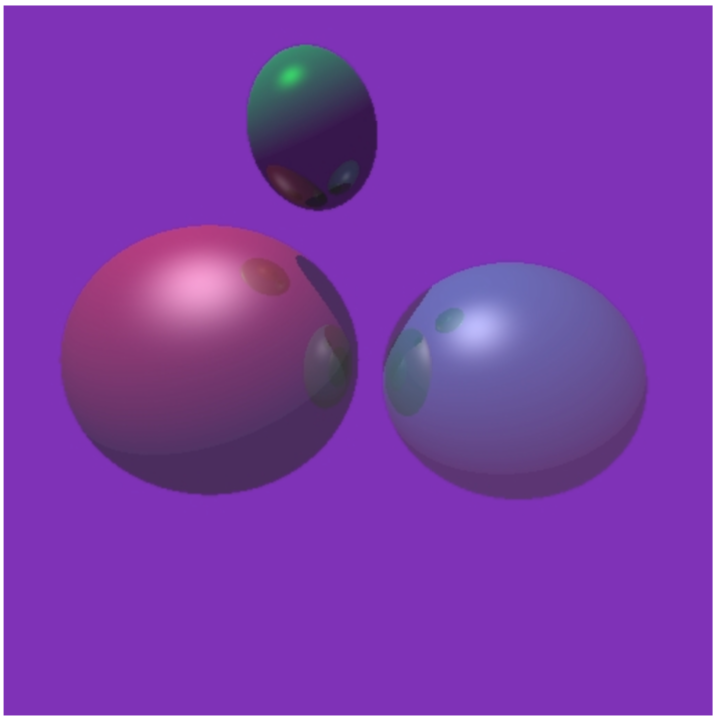
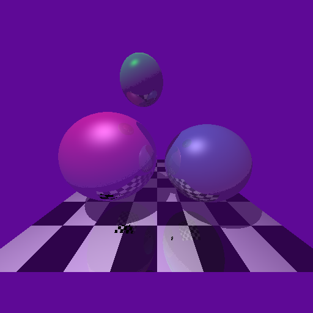
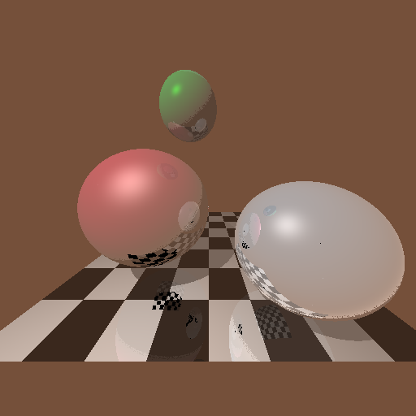

   This is a C++ implementation of ray tracing. To build this project, please make sure your system has OpenGL and g++ compiler installed.

   building a ray tracer, from the simple version that works on scenes consisting only of spheres to a
   sophisticated program capable of handling arbitrary polygonal environment in an efficient manner;
   Use `make raycast` to create an executable called `raycast`. The program requires between 2 to 8 command
   line arguments:
        ./raycast [–u | –d] step_max <options>
   The option –u (user) should be used if you want to render a scene you created (to be defined in the function
   set_up_user_scene() in scene.cpp). To render the default scene, defined in the function set_up_default_scene()
   in scene.cpp, use –d. The next argument specifies the number of recursion levels. For example, when step_max = 0,
   then no reflected or refracted rays are to be cast. The remaining arguments can be used to turn on different features
   of your raytracer. The default, if no flag is provided, is to turn the feature off. There are a total of six features:
        +s: inclusion of shadows
        +l: inclusion of reflection
        +r: inclusion of refraction
        +c: inclusion of chess board pattern
        +f: enabling diffuse rendering using stochastic ray generations +p: enabling super-sampling

   default.bmp should resemble the image below (no transparency or chess board):  
    
   scene.bmp should resemble similar image like below:
   
   mine.bmp should resemble similar image like below:
   

   To compile this project, go to Simple-Ray-Tracer folder, and in your terminal type `make raycast`. To run the
   program similar command like type `./raycast –d 5 +s +r +l +c +r`.
